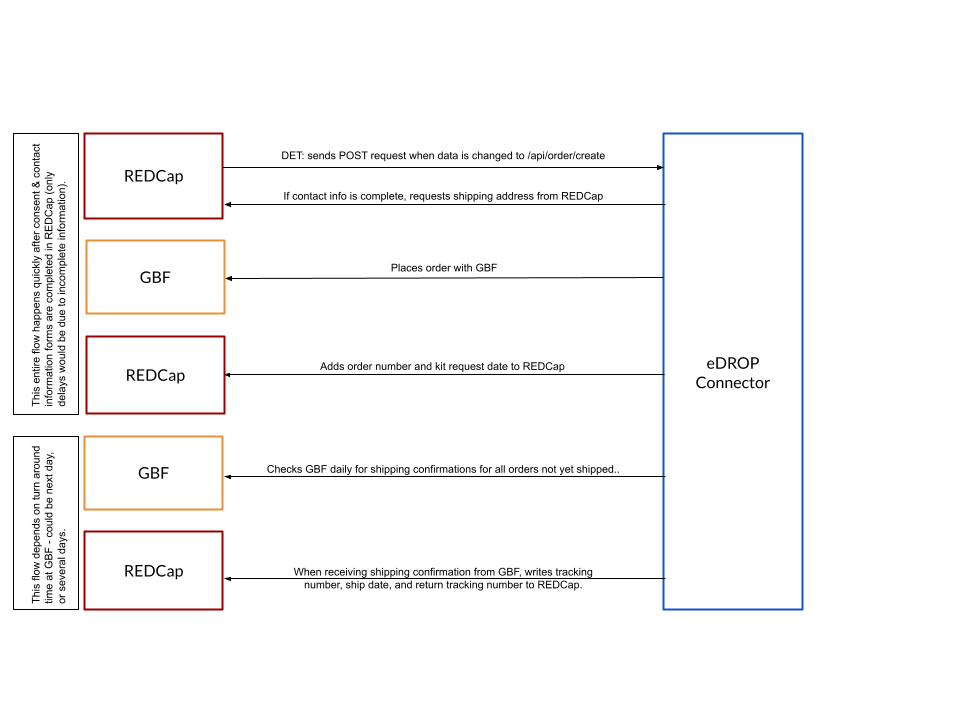

# eDROP Connector

## Running the App
To run this Django app, the easiest is to run it via Docker. 

- Make sure Docker is installed.
- Make sure there is a folder `data/db` in this folder (if it's the first time you run this project, you will need to create `db` inside `data`).
- To run the dev server from this directory, run `docker compose up`
- To run the production server from this directory, run `docker compose -f docker-compose-prod.yml up`
- The app will be available at http://localhost:8000/.

## Developing the App

When developing this app, please keep the following in mind:

- If you add new packages, add them to `requirements.txt` and specify what version should be used.
- We follow the [GitFlow](https://www.atlassian.com/git/tutorials/comparing-workflows/gitflow-workflow) Workflow, which basically means, a branch should be created for each issue off of the `develop` branch. When the code is done for that issue, a pull request to develop should be made. Once we are ready for a new version, `develop` will be merged into `main` and a new release will be created.
- Commits should be previxed with `[issue-number]`, e.g. `[GH-1] added code to accept incoming connections`.
- Branches should be named after the issue they are for prefixed with `feature`, `bug`, or `chore`, e.g. `feature/GH-1`.
- If you need to run migrations or run other Django commands, you will need to log in to the Docker container running the Django app and run the commands from there. The following steps will likely work for this:
   ```
   > docker ps
   CONTAINER ID   IMAGE  COMMAND  CREATED  STATUS  PORTS  NAMES
   575f0aa89a6e   edrop-connector-web "./startup.sh tail -…"  About an hour ago  Up 3 seconds  0.0.0.0:8000->8000/tcp   edrop-connector-web-1
   1a7478580d3e   postgres "docker-entrypoint.s…"  About an hour ago  Up 3 seconds 0.0.0.0:5432->5432/tcp   edrop-connector-db-1
   ```
   Then pick the container id or name and run:
   ```
   docker exec -it edrop-connector-web-1 bash
   ```
   If your container is not called `edrop-connector-web-1`, specify the correct name instead.

   Now you're inside the container and you can run any Django coammend you need.

## Cron Jobs

Cron jobs are scheduled using [APScheduler](https://apscheduler.readthedocs.io/en/latest/index.html) and [django-apscheduler](https://github.com/jcass77/django-apscheduler). There is a Django management command starts the cron jobs, which will need to be run separately from the Django app. In deployment mode when using Supervisor (see below), this job will be started automatically. When running in dev mode (using `docker-compose.yml`), you will need to start the cron jobs by hand using:
```
docker exec -it edrop-connector-web-1 python manage.py runapscheduler
```

How often the job is run can be scheduled via the `CRON_JOB_FREQUENCEY` settings. However, for developement, you will want to change the frequency to something like every few seconds by directly altering the code in `track/management/commands/runapscheduler.py`.

```
scheduler.add_job(
      check_for_tracking_numbers_job,
      trigger=CronTrigger(day=settings.CRON_JOB_FREQUENCEY), # set parameter to e.g. second="*/10" to run every 10 seconds
      id="check_for_tracking_numbers_job",  # The `id` assigned to each job MUST be unique
      max_instances=1,
      replace_existing=True,
    )
```

## Running in deployment mode

To use the Docker containers used when deployed, start Docker like so:

```
docker compose -f docker-compose-prod.yml up
```

This will start a Docker container with Supervisor and Gunicorn, instead of the Django dev server. To restart Django in this mode, you will need to connect to the Docker container and run:

```
supervisorctl -c /etc/supervisor/supervisord.conf restart edrop
```

## Server Installation

1. Clone the repository.
2. Copy the environment files needed (`.env`, `.env_app`, and `.docker-env`):
   ```
   cp .env_app .env
   cp .env_app_example .env_app
   cp .docker-env-example .docker-env
   ```
2. Adjust the variables in the environemnt files as needed.
3. Add service file to be able to start eDROP throush systemd to `/etc/systemd/system/edrop.service`:
   ```
   [Unit]
   Wants=docker.service
   After=docker.service

   [Service]
   RemainAfterExit=yes
   ExecStart=/usr/bin/docker compose -f /opt/edrop/edrop-connector/docker-compose-prod.yml up
   ExecStop=/usr/bin/docker compose -f /opt/edrop/edrop-connector/docker-compose-prod.yml down

   [Install]
   WantedBy=multi-user.target
   ```
   And reload systemd daemon, enable service so it starts on boot.
4. Create database directory
   ```
   mkdir data/db
   ```
5. Try to run it:
   ```
   docker compose -f docker-compose-prod.yml up
   ```
6. If that works, stop and start through systemd.
7. Edit webserver to proxy eDROP Django app.

## Processing Flow

Below is a diagram that describes the process flow of eDROP Connector.



## Copyright 
By committing code to this repository, you agree to transfer or license your copyright to the project under its current terms.
